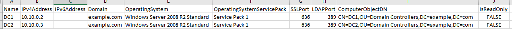

#List Domain Controllers

***Background:***

The purpose of this quick PowerShell script is to go through a list of domains and pull a base set of information that I've found useful during auditing. It outputs to a CSV file that can be used for referencing later. 

The script only requires domain users privilege in each target domain.

***Usage:***

Modify domains.txt file with a list of target domains.

As an alternative, you can replace:

```PowerShell
$domainNames = Get-Content .\domains.txt
```
With an array of your own:

```PowerShell
$domainNames = "Example.com","Contoso.net"
````

To run the program, from PowerShell simply call the script:

```PowerShell

.\listDomainControllers.ps1
```

Example Output looks like:


